```{r setup, include=FALSE}
knitr::opts_chunk$set(echo = TRUE)
library(png)
library(gridExtra)
```

## 1. Summary

In this analysis, we sought to develop a model that predicts the annual average streamflow for Canadian watersheds by studying the effects of climate variables on the annual average streamflow to provide crucial information for efficient water resource management. This helps in reducing the economic and financial loss due to floods, droughts and dam mismanagement. By training an ensemble of prediction models like XGBoost, Gradient Boosting Machine, Random Forest, Quantile Regression Forests, Support Vector Machine and Linear Regression with important variables selected through variable importance techniques like Boruta and Forward Stepwise Regression and predicting the annual average streamflow, we achieved a high prediction performance with the lowest Root Mean Square Error (RMSE) of 0.1878 for the Ensemble Model. These techniques with further analysis can be broadly applied to predict average annual streamflow across different watersheds throughout the planet without the spatial and temporal input. 	

## 2. Introduction

A watershed refers to an area of land where rainfall and snowmelt collect and stream into a common outlet like rivers, lakes and other bodies of water. Understanding watershed stream flow is important for water resource management e.g. irrigation, hydroelectric power and flood control. The study aims to investigate and understand the effect of climate variables on the watershed’s streamflow.					
The analysis aims to address the following questions:	

- Can the data from one catchment be used to extrapolate stream flow in another catchment given the climate variables?
 						
- Can we detect the unusual streamflow activity accurately that can lead to severe adverse effects for the nearby ecosystem and populated areas?

More specifically, the analysis has the following objectives to answer the above questions:

- To build an outlier detection system to detect the unusual streamflow activity (extreme values) 						
- To translate the relationship between the response and multiple predictors, measured over many years, into insightful visualisations
 						
- To find important climate variable(s) and determine the effect of said variable(s) on the streamflow
 						
- To model and predict the average stream flow values.

This report summarises all of the primary statistical modelling and analysis results associated with the study. The remainder of this report is organised as follows: Section 3 describes the data collection, provides measurement of the variables and summarises the data. Section 4 presents the data preprocessing and statistical modelling techniques used to answer the client’s research questions. Section 5 summarises and interprets the results of the statistical analysis conducted. Appendices are provided for further exploratory data analysis along with the code used for the statistical modelling. Section 6 describes the outlier detection performed on the predicted stream flow values. Lastly, Section 7 presents the limitations and challenges in conducting this analysis.

## 3. Data Description

The data was collected daily by satellites and an aggregation of the data (annual averages) was provided for the propose of this analysis. Data contains observations from 23 medium-sized water catchment areas located around Canada. The size of these watershed areas ranges from 50 $km^2$ to 10,000 $km^2$. The data of various climate variables was taken from the year 1980 to 2018. There are 774 rows and 12 columns with no missing data. An additional dataset with the watershed shape data (Longitude, Latitude) was also provided by the client for further analysis of the effect of spatial features on the streamflow. *Please refer to the Appendix I (A.1.0) for the full data dictionary (w/ abbrev.)*

\begin{center}
Table 1: Description of variables used for analysis
\end{center}

|  | **Variable** |**Abbrev.** |**Unit** | **Description** |
|-|-----|------|:-:|-----------|
| 1. | Mean Yearly Evaporation  |EVA| $m$ | Depth of water evaporates from the catchment area |
| 2. | Mean Yearly Potential Evaporation  |PEVA | $ml$ | The amount of evaporation that would occur if a sufficient water source were available |
| 3. | Mean Snow Density |SDEN| $kg^{3}$$m^{-3}$ | The density of the snow |
| 4. | Mean Snow Depth |SDEP| $m$ | The depth of new and old snow that remains on the ground at observation time |
| 5. | Mean Snow Depth of Snow Water Equivalent |SWEQ| $m$ | Water equivalent of melted snow collected in the gauge since the last observation |
| 6. | Mean Yearly Temperature |TEMP| $°C$ | The temperature measured in °C |
| 7. | Mean Yearly Snowfall |SFAL| $m$ | The record of snowfall (snow, ice pellets) since the previous snowfall observation (24 hours) |
| 8. | Mean Yearly Snowmelt |SMELT| $m$ | The depth of runoff produced from melting snow |
| 9. | Mean Yearly Total Precipitation |PREC| $m$ | The depth of total rainfall and water-equivalent of snowfall |
| 10. | Year |-| year | The year the data was recorded in |
| 11. | Grid Code |-| - | Grid code where the watershed is located |
| 12. | Annual Average Streamflow (Response) |Q| $m^{3}$ $year^{-1}$ | The average daily stream flow recorded for a year |

\begin{center}
Table 2: Summary Statistics of all the variables
\end{center}
| **Var** | **EVA** | **PEVA** | **SDEN** | **SDEP** | **SWEQ** | **SFAL** | **SMELT** | **TEMP** | **PREC** | **Q** |
|:-:|:-:|:-:|:-:|:-:|:-:|:-:|:-:|:-:|:-:|:-:|
| **Min** | 0.123 | 0.072 | 131.1 | 0.048 | 0.008 | 35.61 | 17.78 | -7.153 | 0.364 | 0.045 |
| **25%** | 0.293 | 1.141 | 166.9 | 0.213 | 0.044 | 96.80 | 83.57 | -1.417 | 0.684 | 0.599 |
| **50%** | 0.352 | 1.353 | 194.5 | 0.319 | 0.077 | 128.1 | 117.0 | 0.190 | 0.768 | 0.899 |
| **Mean** | 0.364 | 1.238 | 195.0 | 0.376 | 0.097 | 136.6 | 127.2 | 0.135 | 0.779 | 0.949 |
| **75%** | 0.427 | 1.509 | 217.5 | 0.507 | 0.133 | 166.8 | 163.3 | 1.806 | 0.872 | 1.233 |
| **Max** | 0.7112 | 1.999 | 290.7 | 1.120 | 0.382 | 332.5 | 333.8 | 7.014 | 1.270 | 2.436 |

Fig 1: Relationship b/w explanatory & response variables  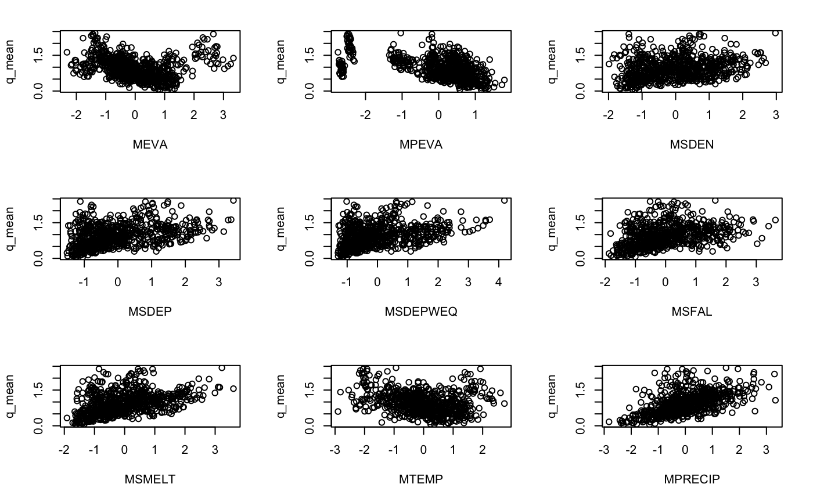  |  Fig 2: Comparing different explanatory variables (before scaling) 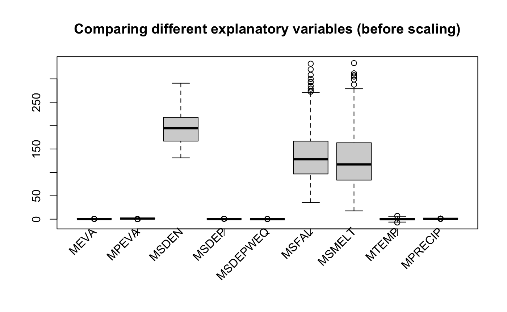
:-------------------------:|:-------------------------:

```{r echo=FALSE, out.width='70%', fig.align="center"}
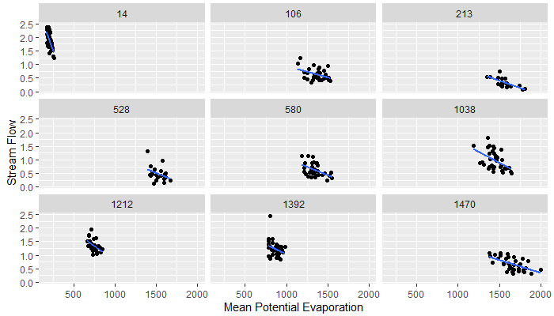
```

\begin{center}
\textbf{Fig 3}: Stream Flow vs Mean Potential Evaporation for Selected Gridcodes
\end{center}

Looking more closely at the data variables broken out by gridcode (see Fig XX as an example), there are some interesting results. For many gridcodes, there appears to be a much stronger linear relationship between climate variables and stream flow and these relationships appear to have different intercept and slope values. This suggests that there may not be a one size fits all approach to fitting a regression model based on annual climate variables alone and different slopes for different gridcodes may need to be considered.

## 4. Methods

### 4.0. Pipeline

Below in Fig 3, we have a Proof-of-Concept pipeline that addresses all of the client's research questions. A breakdown of each of the steps shown in the end-to-end workflow diagram is covered below. We have successfully completed our Model Training and Initial Testing. Our future work will encompass performing Hyperparameter Tuning and implementing the Anomaly Detection system.

\begin{center}
Fig 3: End-to-End Pipeline
\end{center}

```{r echo=FALSE, out.width='100%'}
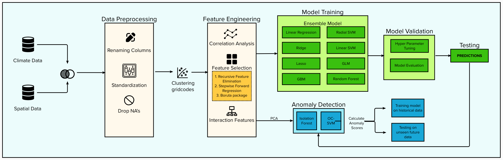
```

### 4.1. Feature Selection

One of the most important step in our pipeline was Feature Selection and we have used several different methods to do so:

#### 4.1.1. Pairwise Correlation Analysis\
\
Before using any of the traditional feature selection techniques mentioned below, we investigated if any of the features were highly correlated. We found out that the Mean Snow Depth, Mean Snow Depth of Snowwater Equivalent and the Mean Yearly Snowmelt were highly correlated. For our initial MVP, we have dropped these features as there is insufficient information contained in the linear combination of the above features leading to redundancy. However, as part of our future work, we can perform PCA as well to deal with this issue.

\begin{center}
Fig 6: Heatmap presenting correlation between variables
\end{center}

```{r echo=FALSE, out.width='70%', fig.align="center"}
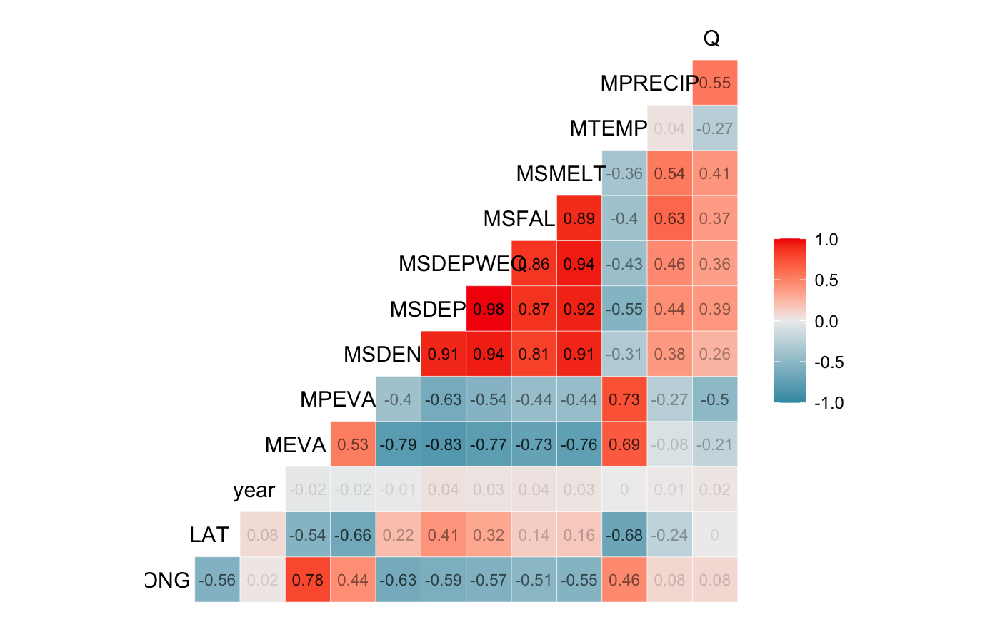
```

#### 4.1.2 Exhaustive Search using Regsubsets()\
\
After excluding the highly correlated variables, we used this method to find the most important variables: Mean Yearly Total Precipitation (MPRECIP), Mean Yearly Temperature (MTEMP), Mean Yearly Potential Evaporation (MPEVA), Mean Yearly Evaporation (MEVA), Mean Snow Density (MSDEN), Mean Yearly Snowfall (MSFAL)

#### 4.1.2. Recursive Feature Elimination using Random Forest\
\
We used RFE to get the most important features that will contribute to the predictive performance of out models. The important features included:gridcode, Mean Yearly Total Precipitation (MPRECIP), 
Mean Yearly Temperature (MTEMP), Mean Yearly Potential Evaporation (MPEVA), Mean Yearly Evaporation (MEVA), Mean Snow Density (MSDEN), Mean Yearly Snowfall (MSFAL)

#### 4.1.3. Variable Importance using `boruta` package\
\
From Fig 7, we see that the most important variables selected ranked in the following order: Mean Yearly Total Precipitation (MPRECIP), gridcode, Mean Yearly Potential Evaporation (MPEVA), Mean Yearly Evaporation (MEVA), Mean Yearly Temperature (MTEMP), Mean Yearly Snowfall (MSFAL), cluster, Mean Snow Density (MSDEN)

It is to be noted that the results from the above methods used for feature selection align with each other and are hence reliable.
\
\
\
\
\begin{center}
Fig 7: Variable Importance (using `boruta` package)
\end{center}

```{r echo=FALSE, out.width='70%', fig.align="center"}
knitr::include_graphics('image/000011.png')
```


#### 4.1.4. Forward Stepwise Regression\
\
This method was used to find important variables as well but it was exclusively used to find the important interaction *(please refer to A.1.1 for the definition)* terms for the Linear models. The two plots below are comparing the performance metrics of the linear model with different subset sizes of the feature space (with/without interaction terms respectively). We see that after 6 features without any interaction terms, the curve for all metrics plateaus indicating that 6 features is a good subset size to maximize the performance. Similarly, when including the interaction terms, we see the same result after 19 variables. *(The complete list of variables can be found in the Appendix I (A.1.2))*.

\

Fig 8: Feature Selection w/o Interaction terms (Forward Stepwise Regression)   |  Fig 9: Feature Selection w/ Interaction terms (Forward Stepwise Regression) 
:-------------------------:|:-------------------------:
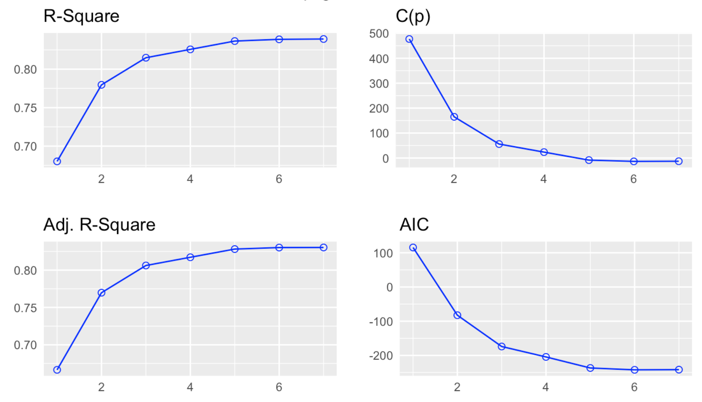  |  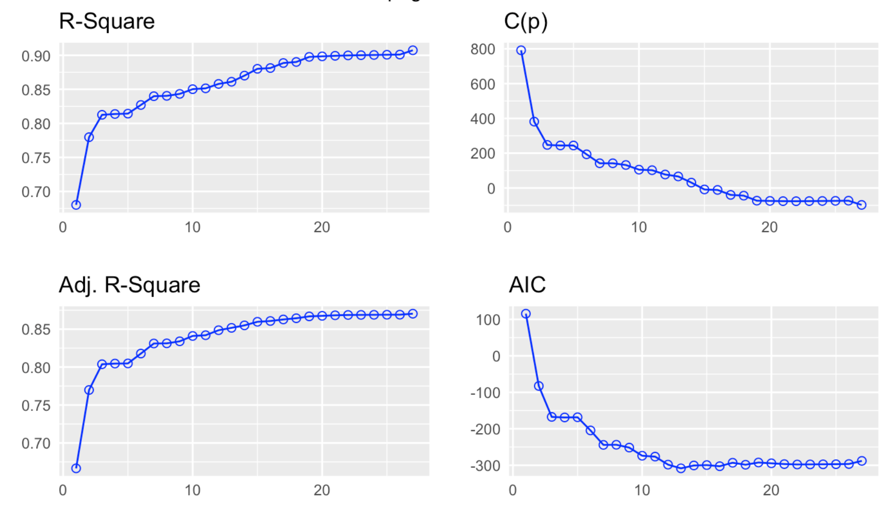

### 4.2. Model Training

A good variety of models were implemented as a part of our analysis for extensive results. Two sets of models where trained to capture both the effect of individual co-variate terms and the interaction terms on the predictive performance of the model. Please refer to Table 3 and Table 4 for results that denote the predictive performance of the models. 

#### 4.2.1. Linear Models\
\
We start with Linear Regression as our baseline model. After applying the above feature selection methods, we train a Generalized Linear Model and some Regularized Linear Models like the Lasso and Ridge Regression with a 5-fold cross validation to test the model performance on the training data. We train a similar set of models with interaction terms as features and we see slightly better results than the former method.

#### 4.2.2. Support Vector Machines\
\
To add further complexities to the previous models, we trained Support Vector Machines that expands our feature space using different kernels. We have used a linear and a radial kernel to compare performance of models with and without the complexities relating to Linearity respectively. In the latter kernel, only the neighboring behavior of data is taken into account which means only those data points influence the modelling compared to to former whose performance is similar to a Linear model. From Table 3 and Table 4, we see that the Linear SVM with interaction terms performs slightly better than Linear SVM without the interaction terms. Wheras, the Radial SVM without interaction terms performs slightly better than Radial SVM with the interaction terms. 

#### 4.2.3. Tree Models\
\
We used two tree-based models such as Random Forest and Gradient Boosting Machine to improve the performance compared to the above models. From Table 3 and Table 4, we see that the Random Forest with interaction terms has comparable results with Random Forest without interaction terms. However, the GBM without interaction terms gives surprising better results than the GBM with interaction terms.

#### 4.2.3. Ensemble Models\
\
We trained two Ensemble models with/without the interaction terms that combine the above listed 8 models to produce improved results. These models generally produce more accurate predictions than a single model. From Table 3 and Table 4, we see that that the Ensemble Model with interaction terms has significantly better results compared to the Ensemble Model without interaction terms. Therefore, based on the testing evaluation metrics from Table 3 and 4, we chose the Ensemble Model with the interaction terms as our best model.
<!---
Fig 10: Comparing In-sample prediction performance for different models w/o Interaction terms   |  Fig 11: Comparing In-sample prediction performance for different models w/ Interaction terms 
:-------------------------:|:-------------------------:
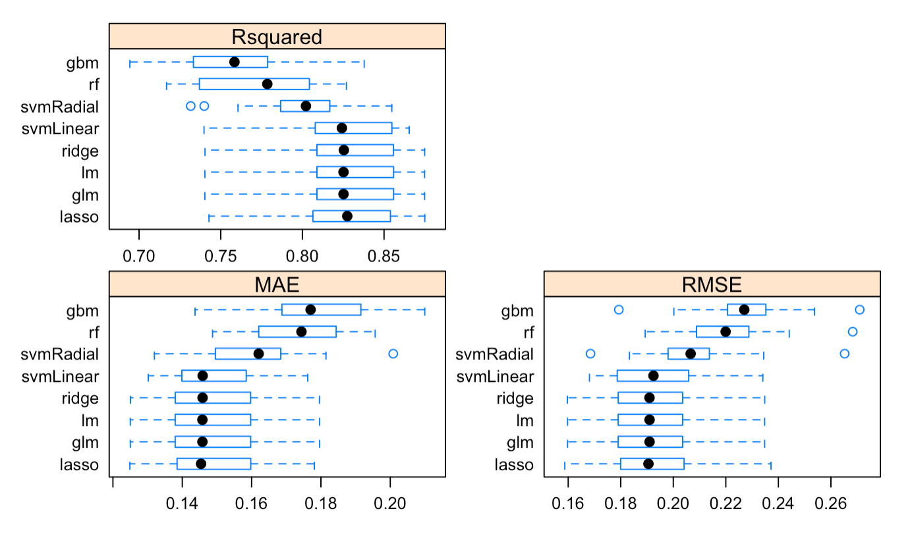  |  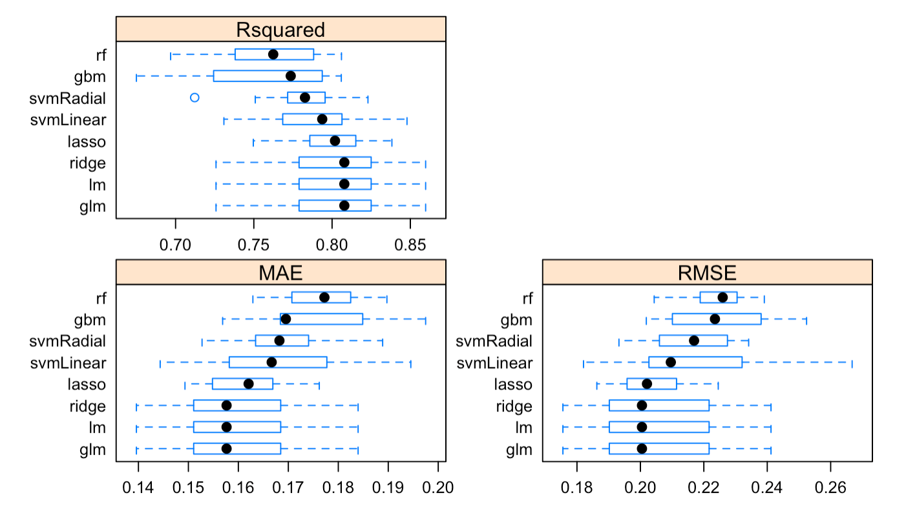
--->

```{r echo=FALSE, out.width='100%', fig.align="center"}
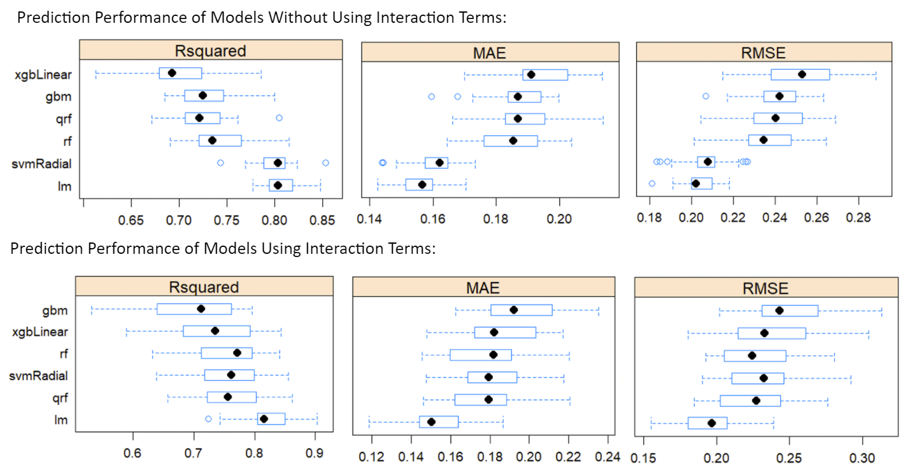
```

\begin{center}
\textbf{Fig 11}: Comparing Prediction Performance for Different Models Without and With Interaction Terms
\end{center}

## 5. Results

From Table 3, we see that the GLM and the Linear Regression model have the lowest RMSE and MAE with the highest R2 value, meaning they have the best predictive performance out of all the models with no interaction terms. 

\begin{center}
Table 3: Comparing out-of-sample evaluation metrics of different model without the interaction terms
\end{center}

| **Models** | **RMSE** | **R2** | **MAE** |  |
|---|:---:|:---:|:---:|---|
| Random Forest | 0.2479 | 0.7123 | 0.1884 |  |
| Gradient Boosting Machine | 0.2401 | 0.7301 | 0.1847 |  |
| Linear Regression | 0.1928 | 0.8260 | 0.1447 | (*) |
| Lasso Regression | 0.1940 | 0.8239 | 0.1455 |  |
| Ridge Regression | 0.1928 | 0.8259 | 0.1448 |  |
| Generalized Linear Model | 0.1928 | 0.8260 | 0.1447 | (*) |
| Linear Support Vector Machine | 0.1966 | 0.8191 | 0.1479 |  |
| Radial Support Vector Machine | 0.2122 | 0.7892 | 0.1574 |  |
| Ensemble Model | 0.1959 | 0.8204 | 0.1474 |  |

From Table 4, we see that once again that the ensemble of all the 8 models listed has the lowest RMSE and MAE with the highest R2 value, meaning it has the best predictive performance out of all the individual models with interaction terms. 

\begin{center}
Table 4: Comparing out-of-sample evaluation metrics of different model with the interaction terms
\end{center}

| **Models** | **RMSE** | **R2** | **MAE** |  |
|---|:---:|:---:|:---:|---|
| Random Forest | 0.2442 | 0.7208 | 0.1857 |  |
| Gradient Boosting Machine | 0.2272 | 0.7584 | 0.1679 |  |
| Linear Regression | 0.1854 | 0.8392 | 0.1416 |  |
| Lasso Regression | 0.1918 | 0.8278 | 0.1485 |  |
| Ridge Regression | 0.1926 | 0.8263 | 0.1452 |  |
| Generalized Linear Model | 0.1854 | 0.8392 | 0.1416 |  |
| Linear Support Vector Machine | 0.1886 | 0.8335 | 0.1445 |  |
| Radial Support Vector Machine | 0.2233 | 0.7665 | 0.1634 |  |
| Ensemble Model | 0.1795 | 0.8492 | 0.1359 | (*) |

The plots below show how much the prediction from our best 3 models deviated from actual value therefore giving us a rough estimation of whether a model is a good fit or not. We clearly see that the latter two plots for GLM and Linear Regression are almost comparable whereas for the Ensemble Model, the points are closer to the fitted line indicating a good fit.

Fig 12: Predicted vs Actual Values (Ensemble Model)   |  Fig 13: Predicted vs Actual Values (GLM) | Fig 11: Predicted vs Actual Values (Linear Regression)
:-------------------------:|:-------------------------:|:-------------------------:
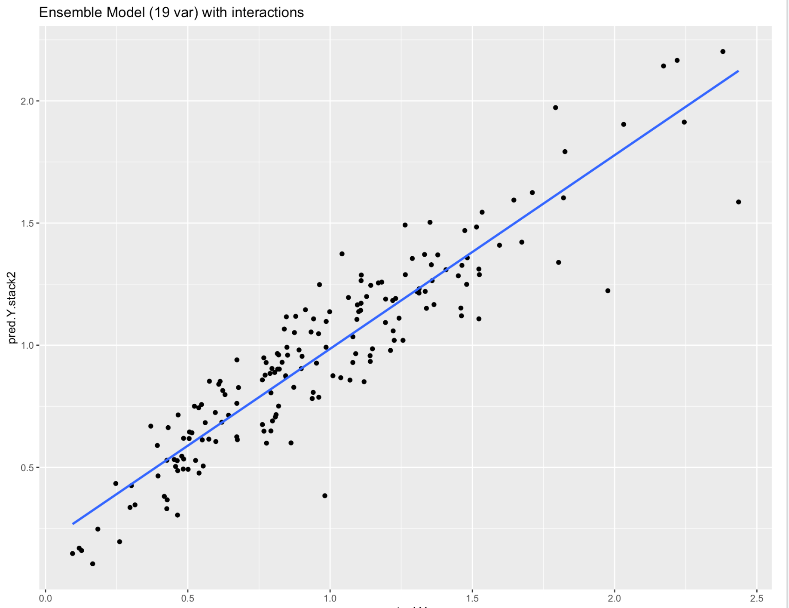  |  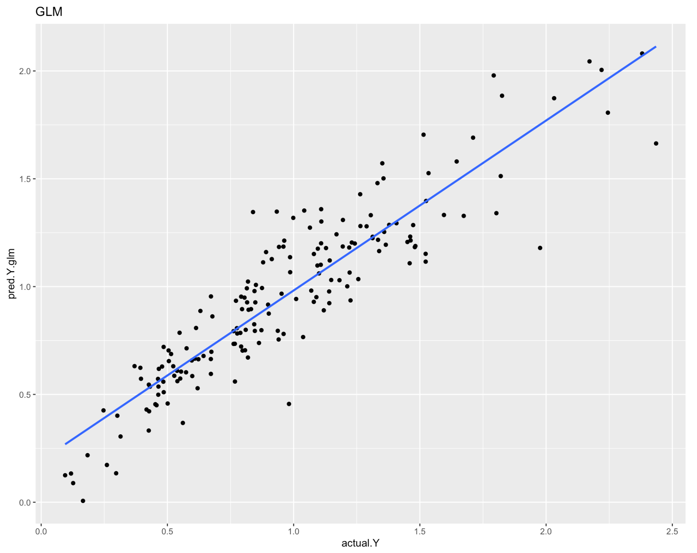 | 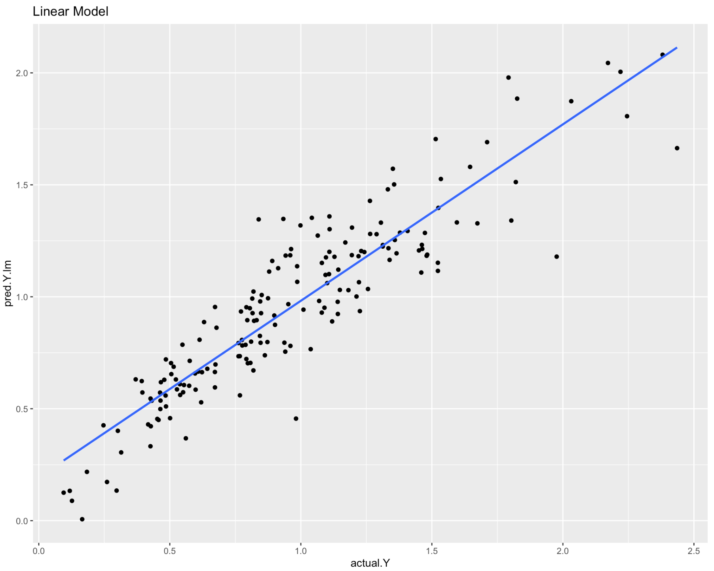 |

Comparing the predictive performance of the best models from both Table 3 and Table 4, we see that the latter (Ensemble Model, RMSE: 0.1795) has a better performance. Therefore, the best model we chose for making predictions was the Ensemble Model with the interaction terms.

## 6. Conclusion

After all the model iterations and improvements, we were able to achieve fairly good results with the Ensemble Model taking into account the interaction effect between variables. These results have large implications when it comes to water resource management both financially and economically. We have conducted our primary analysis taking into account the spatial data (e.g. gridcodes) which serves as a good MVP to predict the streamflow. 

As a side interest and to expand upon the idea of predicting the streamflow solely using climate variables and not any spatial and temporal data, we conducted an analysis and trained models without this data and the predictive performance dropped significantly. Although this addresses the client's first research question of whether one catchment can be used to extrapolate stream flow in another catchment, the limitation we faced was lack of training data. To be able to model such a complex problem using climatic variables, we need more data to train our model which can help with improving the predictive performance of the model.

To address the second research question of whether or not we can detect the unusual streamflow activity accurately, we built a proof of concept pipeline for the outlier detection system. It will take the features from our prediction model as input and label the observations as either anomalous or regular depending on the anomaly scores which are the measures of deviation from normal behavior. We will face the same challenge here - lack of training data,. This will lead to increase in false positives and false negatives in the outlier detection system which can have detrimental consequences.  For example, not being able to detect a subtle increase in the streamflow (false negatives) which could lead to irrigation problems and in severe cases even floods. Or getting a huge pool of outlier values (false positives) that will raise false alarms of anomalous behaviour more often than desired.


### 6.1. Future Steps

After modelling the data with the techniques above, we believe the results could be further improved by investigating some aspects further more and in order to deliver the complete pipeline, we will need focus on the follwoing next steps:

- Perform Hyperparameter Tuning to fine-tune the model and carry out model validation

- Find better techniques to select the best interaction variables and comparing its results with the Forward Stepwise Regression

- Implement the outlier detection system from he pipeline using Isolation Forest, OC-SVM models and testing it on unseen data.


## 7. References

- Government of Canada / Gouvernement du Canada. (2021, November 25). Government of Canada / gouvernement du Canada. Climate. Retrieved February 5, 2022, from https://climate.weather.gc.ca/glossary_e.html 
- US Department of Commerce, N. O. A. A. (2012, March 8). Snow measurement guidelines. Snow Measurement Guidelines. Retrieved February 5, 2022, from https://www.weather.gov/gsp/snow 
- Janssen, J., & Ameli, A. A. (2021). A Hydrologic Functional Approach for Improving Large‐Sample Hydrology Performance in Poorly Gauged Regions. Water Resources Research, 57(9), e2021WR030263.

\
\
\
\
\
\
\
\
\
\
\
\
\
\
\
\
\

## 8. Appendix I (For Client)


### A.1.1 Interaction Term

> "In statistics, an interaction is a special property of three or more variables, where two or more variables interact to affect a third variable in a non-additive manner. In other words, the two variables interact to have an effect that is more than the sum of their parts."

**Reference**: Statistical interaction: More than the sum of its parts. Statistics Solutions. (2021, June 22). Retrieved February 21, 2022, from https://www.statisticssolutions.com/statistical-interaction-more-than-the-sum-of-its-parts/ 

### A.1.2. Important Variables using Forward Stepwise Regression (including interaction terms)

|   |   |
|---|---|
| gridcode | MEVA:MSDEN |
| year:MPRECIP | MEVA:MSFAL |
| MEVA | grid-<br>code:MEVA |
| MTEMP | gridcode:MTEMP |
| year | MPEVA:MTEMP |
| MSDEN | gridcode:MPRECIP |
| MPEVA | MSFAL:MPRECIP |
| MSFAL:MTEMP | gridcode:MSDEN |
| MTEMP:MPRECIP | MEVA:MPEVA |
| MPRECIP |  |

\
\
\
\
\

## 9. Appendix II (For Mentor)

## 9.1. Installing Packages

```{r lib, message=FALSE, warning=FALSE}
#Sys.setenv(LANG = "en")
library(tidyverse)
library(ggplot2)
library(GGally)
library(DataExplorer)
library(olsrr)
library(gridExtra)
library(cluster)
library(factoextra)
library(caretEnsemble)
library(caret)
library(mlbench)
library(Metrics)
library(Boruta)
library(tidymodels)   # packages for modeling and statistical analysis
library(tune)         # For hyperparemeter tuning
library(workflows)    # streamline process
library(tictoc)
library(quantregForest)
library(e1071)
library(solitude) 
library(RColorBrewer)
```

## 9.2. Loading the Data

```{r 1.1, echo=TRUE, message=FALSE, warning=FALSE}

# Loading the data
dt = read_csv('data_stat450.csv')

dt2 = dt

# Removing 'year' column
dt = dt[-c(2)]

# Renaming column names for simplicity
colnames(dt) = c('gridcode','EVA','PEVA', 'SDEN','SDEP','SWEQ','SFAL','SMELT','TEMP', 'PREC','Q')
colnames(dt2) = c('gridcode','year','EVA','PEVA', 'SDEN','SDEP','SWEQ','SFAL','SMELT','TEMP', 'PREC','Q') # for anomaly detection

# Converting gridcode to a factor 
dt$gridcode = as.factor(dt$gridcode)

head(dt)
length(unique(dt$gridcode)) # 23
```

## 9.3. Explanatory Data Analysis

```{r 1.2}
# Generating summary statistics for dt
summary(dt)

# EDA
plot_intro(dt)
plot_missing(dt)
plot_bar(dt)
plot_histogram(dt)
plot_density(dt)
plot_qq(dt)
plot_qq(dt, by = "gridcode")
plot_correlation(dt)
plot_boxplot(dt, by = "gridcode")
plot_scatterplot(split_columns(dt)$continuous, by = "Q")
plot_prcomp(na.omit(dt), maxcat = 4L)

# Checking dimensions of dt
nrow(dt) # 774
ncol(dt) # 11

```

## 9.3.1. Examining Variables by Gridcode
```{r vars_by_gridcode, eval=FALSE}
# look at Stream Flow vs Mean Potential Evaporation
set.seed(123)
dt.valid <- na.omit(dt)
gridcode_sample <- dt.valid |> select(gridcode) |> distinct()
gridcode_sample <- sample(gridcode_sample$gridcode, 9)
dt.valid |> 
    filter(gridcode %in% gridcode_sample) |>
    ggplot(aes_string(x="PEVA", y="Q")) +
    geom_point() +
    facet_wrap(~gridcode) +
    geom_smooth(method="lm", se=FALSE, formula=y~x) +
    labs(title="Stream Flow vs Mean Potential Evaporation") +
  ylab('Stream Flow') +
  xlab('Mean Potential Evaporation') + 
  theme(plot.caption = element_text(hjust = 0))
```
### 9.4. Data Preprocessing
```{r 2.1.1, eval=FALSE, warning=FALSE}
labels <- paste(colnames(dt[,2:11]))
boxplot(dt[,2:11],  xaxt = "n",xlab = "",
        main = 'Comparing different explanatory variables (before scaling)')
axis(1, labels = FALSE)
text(x =  seq_along(labels), y = par("usr")[3] - 1, srt = 60, adj = 1,
     labels = labels, xpd = TRUE)
```
#### 9.4.1. Transformations
```{r}
# Transformations

## right-skewed
#dt$Q = sqrt(dt$Q)
dt$EVA = (dt$EVA)^(1/3) 
dt$SDEN = sqrt(dt$SDEN)
dt$SDEP = log(dt$SDEP)
dt$SWEQ = log(dt$SWEQ)
dt$SFAL = sqrt(dt$SFAL)
dt$SMELT = sqrt(dt$SMELT)

# left-skewed
dt$PEVA = sqrt(2000-dt$PEVA) 

plot_density(dt|> select(EVA,SDEN,SDEP, SWEQ, SFAL, SMELT,PEVA))
```
#### 9.4.2. Preprocessing Pipeline

```{r 2.1.2, warning=FALSE}
set.seed(2020)
rec <- recipe(Q ~., 
              data = dt[,2:11]) %>%  
  step_corr(all_predictors()) %>%                       # removing highly correlated features
  # Z-Score Standardization
  step_center(all_numeric(), -all_outcomes())%>%        # centering data at mean = 0
  step_scale(all_numeric(), -all_outcomes())            # scaling data with variance  = 1

trained_rec =  prep(rec, training = dt, retain = TRUE)
dt_prep = cbind(gridcode = dt$gridcode, as.data.frame(juice(trained_rec)))

# Separating the actual test set w/o labels
main_dt <- na.omit(dt_prep)
test_nolabel_df <- dt_prep[is.na(dt$Q),]

main_dt

labels <- paste(colnames(main_dt[,2:8]))
boxplot(main_dt[,2:8],  xaxt = "n",xlab = "")
axis(1, labels = FALSE)
text(x =  seq_along(labels), y = par("usr")[3] - 1, srt = 60, adj = 1,
     labels = labels, xpd = TRUE)
```

#### 9.4.3. Relationship b/w explanatory variables & the response
```{r}
plot_scatterplot(split_columns(main_dt)$continuous, by = "Q")

ggpairs(main_dt[,2:8],lower = list(continuous = wrap("smooth", alpha = 0.3, size=0.05)),
      upper = list(continuous = wrap("cor", size=2)))
```

#### 9.4.4. Feature Selection Using `boruta`

```{r}
boruta_output <- Boruta(Q ~ ., data=na.omit(main_dt), doTrace=0)
roughFixMod <- TentativeRoughFix(boruta_output)
boruta_signif <- getSelectedAttributes(roughFixMod)

# Variable Importance Scores
imps <- attStats(roughFixMod)
imps2 = imps[imps$decision != 'Rejected', c('meanImp', 'decision')]
head(imps2[order(-imps2$meanImp), ])  # descending sort

# Plot variable importance
plot(boruta_output, cex.axis=.7, las=2, xlab="", ylab = "Variable Importance")

selected_features <- c('PREC','gridcode','EVA','TEMP','PEVA','SFAL','SDEN')

main_fs <- main_dt[,(colnames(main_dt) %in% append(selected_features, "Q"))]
main_fs
```


#### 9.4.5. Feature Selection Using Forward Stepwise Regression

```{r}
dt_interaction <- main_dt
FS.lm <- lm(Q ~ (.)^2, data = dt_interaction)

OLS <- ols_step_forward_p(FS.lm)
OLS
plot(OLS)
```
### 9.5. Model Training

#### 9.5.1. Splitting Data into Train/Test sets

```{r 5.1}
set.seed(123)
split <- createDataPartition(y=main_fs$Q, p=.8,list=F)
train <- main_fs[split,]
nrow(train)
test <- main_fs[-split,]
nrow(test)
```

#### 9.5.2. Cross-Validation (w/o Interaction terms)
```{r}
set.seed(123)
my_control = trainControl(method = 'repeatedcv', # for “cross-validation”,
                           repeats = 3,
                           number = 10, # number of k-folds
                           savePredictions = 'final',
                           search = 'random')

model_list1 = caretList(Q~.,
                        data = train,
                        methodList = c('lm', 'rf', 'qrf', 'xgbLinear','svmRadial', 
                                       'gbm'),
                        tuneList = NULL)

ensemble1 = caretEnsemble(model_list1, 
                          metric = 'RMSE', 
                          trControl = my_control)

```

#### 9.5.3 Cross-Validation (w/ Interaction terms)
```{r}
model_list2 = caretList(Q ~ gridcode+PREC+SDEN+EVA+gridcode:SFAL+TEMP+PEVA+SFAL+TEMP:PREC+SDEN:SFAL+
                         SFAL:TEMP+SDEN:PREC+EVA:TEMP+gridcode:PEVA+
                         PEVA:TEMP+gridcode:PREC+gridcode:EVA+
                         EVA:SDEN+gridcode:SDEN+SDEN:TEMP,
                data = train,
                        trControl = my_control,
                        methodList = c('lm', 'rf', 'qrf', 'xgbLinear', 'svmRadial', 'gbm'),
                        tuneList = NULL)

ensemble2 = caretEnsemble(model_list2, 
                          metric = 'RMSE', 
                          trControl = my_control)
```

#### 9.5.4 Evaluation Metrics (w/o Interaction terms)
```{r}
options(digits = 3)
model_results1 = data.frame(
  LM = mean(model_list1$lm$results$RMSE),
  QRF = mean(model_list1$qrf$results$RMSE),
  RF = mean(model_list1$rf$results$RMSE),
  XGBL = mean(model_list1$xgbLinear$results$RMSE),
  SVMR = mean(model_list1$svmRadial$results$RMSE),
  GBM = mean(model_list1$gbm$results$RMSE)
)

best_model_train1 = apply(model_results1, 1, FUN = mean)
print(model_results1)

resamples1 <- resamples(model_list1)
resamples1
summary(resamples1)
dotplot(resamples1, metric = 'RMSE')
modelCor(resamples1)

# Ensemble Model Results
summary(ensemble1)
plot(ensemble1)

scales1 = list(x=list(relation='free'), y=list(relation='free'))
bwplot(resamples1,scales = scales1,layout = c(2,2))
```

#### 9.5.5 Evaluation Metrics (w/ Interaction terms)

```{r}
options(digits = 3)
model_results2 = data.frame(
  LM = mean(model_list2$lm$results$RMSE),
  QRF = mean(model_list2$qrf$results$RMSE),
  RF = mean(model_list2$rf$results$RMSE),
  XGBL = mean(model_list2$xgbLinear$results$RMSE),
  SVMR = mean(model_list2$svmRadial$results$RMSE),
  GBM = mean(model_list2$gbm$results$RMSE)
)

best_model_train2 = apply(model_results2, 1, FUN = mean)
print(model_results2)

resamples2 <- resamples(model_list2)
resamples2
summary(resamples2)
dotplot(resamples2, metric = 'RMSE')
modelCor(resamples2)

# Ensemble Model Results
summary(ensemble2)
plot(ensemble2)

scales2 = list(x=list(relation='free'), y=list(relation='free'))
bwplot(resamples2,scales = scales2,layout = c(2,2))
```

### 9.6 Predictions 

#### 9.6.1. Predictions (w/o Interaction terms)
```{r}

# PREDICTIONS
pred_lm1 <- predict.train(model_list1$lm, newdata = test)
pred_qrf1 <- predict.train(model_list1$qrf, newdata = test)
pred_rf1 <- predict.train(model_list1$rf, newdata = test)
pred_xgbL1 <- predict.train(model_list1$xgbLinear, newdata = test)
pred_svmr1 <- predict.train(model_list1$svmRadial, newdata = test)
pred_gbm1 <- predict.train(model_list1$gbm, newdata = test)
predict_ens1 <- predict(ensemble1, newdata = test)

# RMSE
y_test = test[,8]
pred_RMSE1 <- data.frame(ENS = RMSE(predict_ens1, y_test),
                        LM = RMSE(pred_lm1, y_test),
                        QRF = RMSE(pred_qrf1, y_test),
                        RF = RMSE(pred_rf1, y_test),
                        XGBL = RMSE(pred_xgbL1, y_test),
                        SVMR = RMSE(pred_svmr1, y_test),
                        GBM = RMSE(pred_svmr1, y_test))
                        
print(pred_RMSE1)

best_model_test1 = apply(pred_RMSE1, 1, FUN = mean)

pred_cor1 <- data.frame(ENS = cor(predict_ens1, y_test),
                       LM = cor(pred_lm1, y_test),
                       QRF = cor(pred_qrf1, y_test),
                       RF = cor(pred_rf1, y_test),
                       XGBL = cor(pred_xgbL1, y_test),
                       SVMR = cor(pred_svmr1, y_test),
                       GBM = cor(pred_gbm1, y_test),
                       ENS = cor(predict_ens1, y_test))

print(pred_cor1)
```
```{r}
# par(mfrow = c(3,3))
# plot(pred_lm1, y_test) + abline(0,1, col = 'red')
# plot(pred_qrf1, y_test) + abline(0,1, col = 'red')
# plot(pred_rf1, y_test) + abline(0,1, col = 'red')
# plot(pred_xgbL1, y_test) + abline(0,1, col = 'red')
# plot(pred_svmr1, y_test) + abline(0,1, col = 'red')
# plot(pred_gbm1, y_test) + abline(0,1, col = 'red')
plot(predict_ens1, y_test, xlab="Prediction",ylab="Actual") + abline(0,1, col = 'red')
```

#### 9.6.2. Predictions (w/ Interaction terms)

```{r}

# PREDICTIONS
pred_lm2 <- predict.train(model_list2$lm, newdata = test)
pred_qrf2 <- predict.train(model_list2$qrf, newdata = test)
pred_rf2 <- predict.train(model_list2$rf, newdata = test)
pred_xgbL2 <- predict.train(model_list2$xgbLinear, newdata = test)
pred_svmr2 <- predict.train(model_list2$svmRadial, newdata = test)
pred_gbm2 <- predict.train(model_list2$gbm, newdata = test)
predict_ens2 <- predict(ensemble2, newdata = test)

# RMSE
y_test = test[,8]
pred_RMSE2 <- data.frame(ENS = RMSE(predict_ens2, y_test),
                        LM = RMSE(pred_lm2, y_test),
                        QRF = RMSE(pred_qrf2, y_test),
                        RF = RMSE(pred_rf2, y_test),
                        XGBL = RMSE(pred_xgbL2, y_test),
                        SVMR = RMSE(pred_svmr2, y_test),
                        GBM = RMSE(pred_gbm2, y_test))
                        
print(pred_RMSE2)

best_model_test2 = apply(pred_RMSE2, 1, FUN = mean)

pred_cor2 <- data.frame(ENS = cor(predict_ens2, y_test),
                       LM = cor(pred_lm2, y_test),
                       QRF = cor(pred_qrf2, y_test),
                       RF = cor(pred_rf2, y_test),
                       XGBL = cor(pred_xgbL2, y_test),
                       SVMR = cor(pred_svmr2, y_test),
                       GBM = cor(pred_gbm2, y_test),
                       ENS = cor(predict_ens2, y_test))

print(pred_cor2)
```
```{r}
# par(mfrow = c(3,3))
# plot(pred_lm2, y_test) + abline(0,1, col = 'red')
# plot(pred_qrf2, y_test) + abline(0,1, col = 'red')
# plot(pred_rf2, y_test) + abline(0,1, col = 'red')
# plot(pred_xgbL2, y_test) + abline(0,1, col = 'red')
# plot(pred_svmr2, y_test) + abline(0,1, col = 'red')
# plot(pred_gbm2, y_test) + abline(0,1, col = 'red')
plot(predict_ens2, y_test, xlab="Prediction",ylab="Actual") + abline(0,1, col = 'red')
```

### 9.7. Anomaly Detection

```{r}

train_2 = filter(train, gridcode == 14 | 768) 
q = train_2 |> select(Q) |> data.frame()
train_2 = select(train_2, -Q)

iforest = isolationForest$new()
train_2 = na.omit(train_2)
train_2$gridcode = as.factor(train_2$gridcode)
train_2[,2:7] = data.frame(scale(train_2[,2:7], TRUE, TRUE))

iforest$fit(train_2)
train_2$pred = iforest$predict(train_2)
train_2$label = as.factor(ifelse(train_2$pred$anomaly_score >=0.64, "anomaly", "normal"))

barplot(table(train_2$label),
xlab = "Class",
col = c("red","blue")
)

qplot(train_2$pred$anomaly_score, q$Q, color = train_2$label)

filter(train_2, label=="anomaly")
```
### 9.8. Outlier Detection
```{r}
getPalette = colorRampPalette(brewer.pal(9, "Set1"))

dt.valid <- na.omit(dt2) 
qt <- quantile(dt.valid$Q, na.rm = TRUE)
iqr <- qt[4]-qt[2]
upper.bd <- qt[4]+iqr*1.5
lower.bd <- qt[2]-iqr*1.5

ggplot(dt.valid, aes(y=Q, group=year,x=year)) + 
  geom_boxplot() + 
  geom_hline(yintercept = upper.bd) + 
  geom_hline(yintercept = lower.bd) + 
  ylab("Streamflow") + 
  ggtitle("Streamflow Outliers (Grouped by Year)") 
```